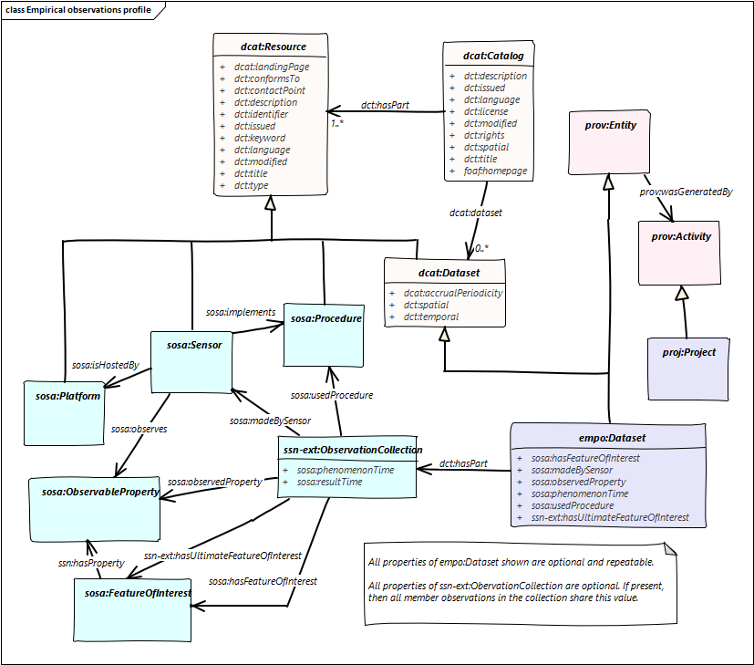

# Empirical Observations
DCAT profile for observation data, using elements from [SOSA/SSN](https://www.w3.org/TR/vocab-ssn/), [ssn-ext](https://w3c.github.io/sdw/proposals/ssn-extensions/), [PROV-O](https://www.w3.org/TR/prov-o/) and [PROJECT](https://dr-shorthair.github.io/ont/project/).

1. [DCAT](https://www.w3.org/TR/vocab-dcat/) is an international vocabulary for cataloguing datasets. 'Dataset' can be understood reasonably broadly, and might include documents. It is implemented in a number of bespoke catalogues in Europe in particular, but is also supported in a well-maintained CKAN plugin, and is also recognised by Google crawlers (alongside schema.org). 
2. DCAT out-of-the-box is very bland. Content classifiers are just `keywords` and `theme` - the latter allows for use of a controlled vocabulary, while the former are just free text. 
3. However, there is a growing set of DCAT 'profiles' to more precisely serve specific communities. These either (a) constrain the generic vocabulary by specifying cardinalities or controlled-vocabularies (b) extend with bespoke properties (c) mix-in terms and structures from other vocabularies (d) some other usage rules and recommendations ... 
4. The current revision of DCAT has agreed to extend the scope to allow for [cataloguing of services](https://github.com/w3c/dxwg/blob/dcat-service-simon/dcat/UML/DCAT-summary.png), alongside data, and also thereby also created extension points for cataloguing other kinds of resources - though these are unlikely to be included in standard DCAT. 
5. The other major activity within the DCAT work is around the formal definition and description of 'profiles', both to solidify the existing ones, and to support the design of future ones. The hypothesis is that (i) if data catalogues use DCAT or profiles of DCAT then they are interoperable at least through the shared parts of the vocabulary, and the role of the extension elements is clear (ii) it provides a common base for the development of new catalogues, saving time and effort since you can build on an existing strong practice. The initial metadata form is not blank ... 
6. The idea explored here is how easy it is to conceive of a profile/extension for domains that we care about. The showed here appears quite narrow in one sense (sensor-observations) though if you read the definitions from the [SOSA/ssn spec](https://www.w3.org/TR/vocab-ssn/) you will find that 'sensor' includes computation, simulation and forecasting, also using humans as sensors -i.e. interpretations and classification. So it potentially covers most empirical data sets. 
